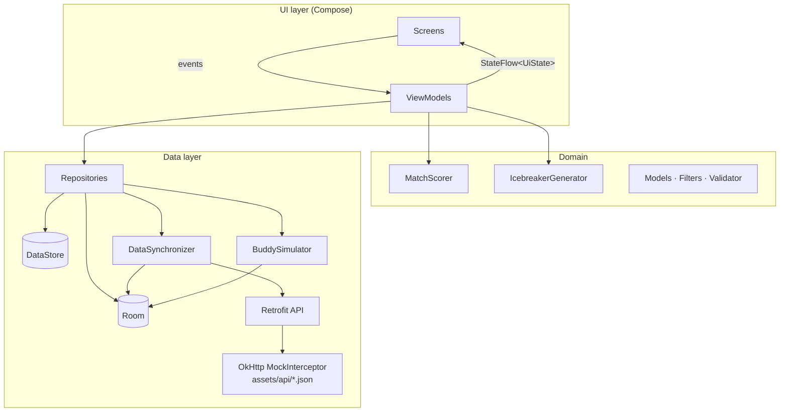
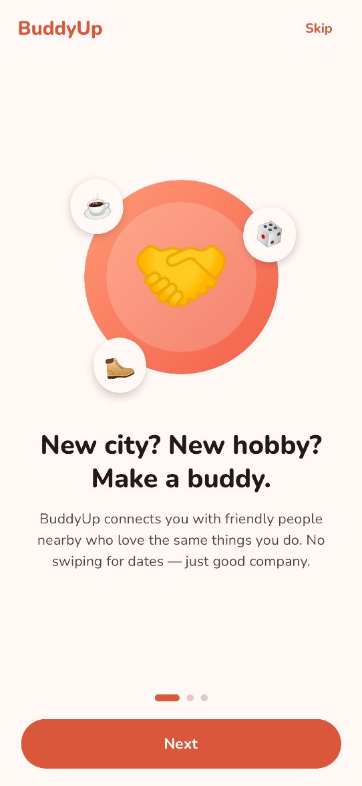
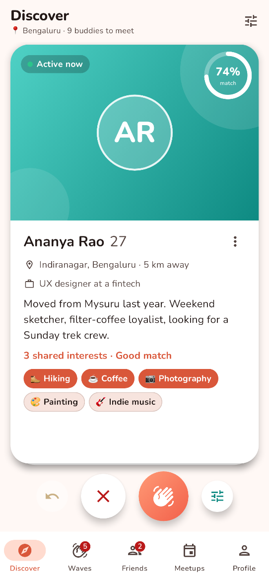
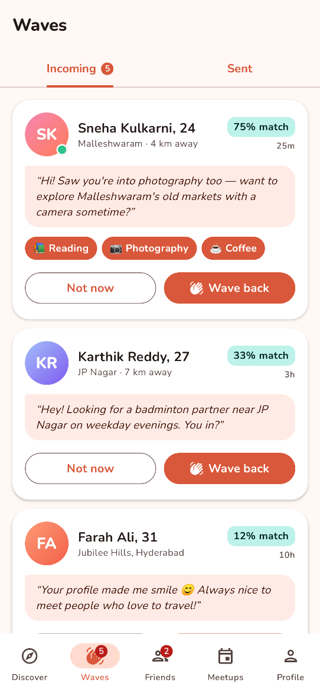
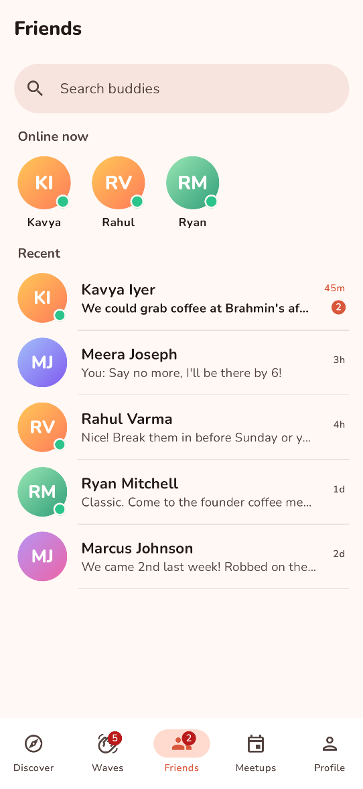
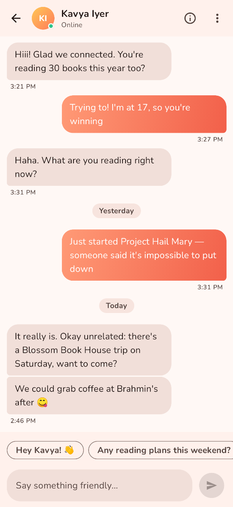
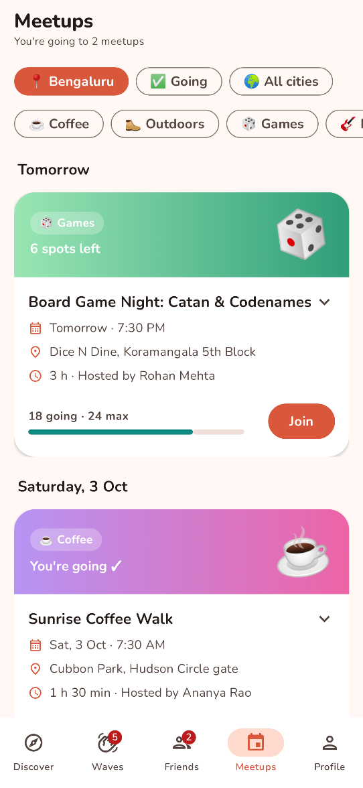
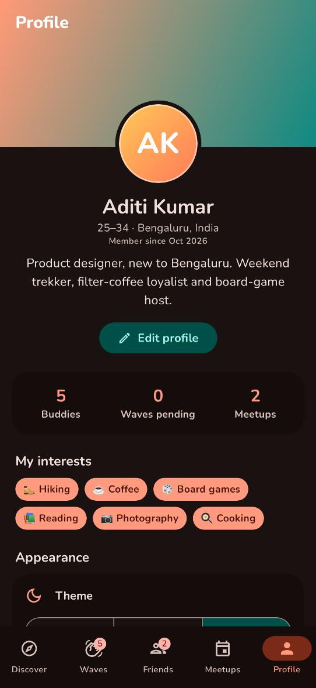
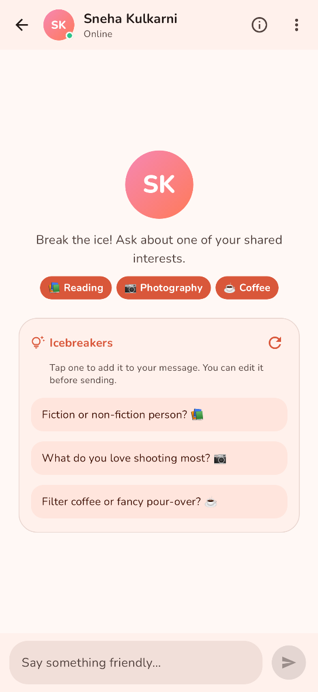
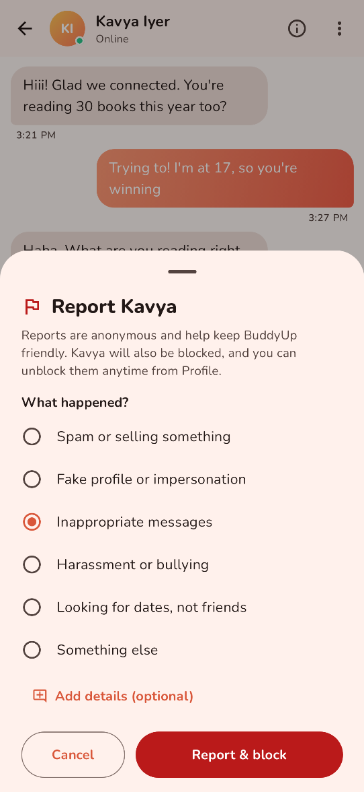

# BuddyUp

**Find your people, nearby.** BuddyUp is a friendship app that helps you meet friendly people in your city who share your interests — for coffee walks, board-game nights and weekend hikes. Not a dating app: just good company.


## Features

- **Onboarding & profile setup** — a three-page `HorizontalPager` intro with an animated page indicator, then a profile form (name, age range, city, bio, 3–8 interests) with validation. Everything is persisted in DataStore, and onboarding is skipped on later launches.
- **Discover** — a stack of profile cards with gradient initials avatars, distance, an "active now" status and highlighted shared interests.
  - Drag a card to swipe it: it rotates as it moves, springs back if you let go early, and shows **Wave** or **Pass** stamps. The Pass and Wave buttons play the same fly-out animation.
  - Each card shows a **compatibility ring** computed by `MatchScorer`, which combines Jaccard similarity of interests, distance falloff and recent activity.
  - A **filter bottom sheet** lets you set maximum distance (or "Anywhere"), an age range slider and must-have interests, and shows a live count of matching people.
  - You can undo your last pass, and the empty state offers "Search anywhere" and "Revisit passed profiles".
- **Waves (requests)** — Incoming and Sent tabs in a swipeable pager with count badges.
  - Wave back or dismiss incoming waves, or withdraw waves you sent. Each of these shows a snackbar with **Undo**.
  - Some people wave back on their own a few seconds after you wave at them. That makes you buddies and triggers an in-app alert with a "Say hi" shortcut.
- **Friends** — your buddies sorted by recent activity, with search (by name, neighborhood or interest), green online dots, last-message previews, unread badges and an "Online now" row.
- **Chat** — conversations stored in Room, with bubbles grouped by sender and day ("Today", "Yesterday"…) and timestamps.
  - An animated typing indicator appears before the other person replies. Replies are chosen from a small reply bank based on what you wrote (a plan, a question, a greeting…).
  - The conversation auto-scrolls to the newest message. One-tap quick replies appear after their latest message, and a profile sheet shows your buddy's details.
- **Icebreakers** — a brand-new chat opens with three conversation starters built from the interests you both share. If you share nothing, you get starters about their neighborhood or city, their own interests, or general questions instead.
  - Starters can also invite them to an upcoming meetup in your city that matches an interest, for example "Want to check out Sunrise Coffee Walk together? ☕". If you already joined it, the starter says you're going.
  - Tap a starter to put it in the message box, where you can edit it before sending. The refresh button cycles through more sets of starters.
  - Short conversations show a small **Need an icebreaker?** chip above the message box, which opens the same starters as a row you can close. The row opens by itself when a chat has been quiet for a day.
  - Starters come from `IcebreakerGenerator`, a pure Kotlin class with curated templates for every interest in the catalog. It is deterministic: the same two people always get the same sets in the same order, so suggestions don't jump around, and a set never repeats a starter.
- **Block & report** — block or report someone from the chat's overflow menu, their Discover card or their profile sheet.
  - **Block** asks for confirmation in a dialog that explains what blocking does. **Report** opens a bottom sheet where you pick a reason and can add a note. Reporting also blocks the person.
  - Blocked people disappear from Discover, Waves, Friends and Chats, and drop out of badge counts. The simulator stops waving back, typing and replying for them. A snackbar offers **Undo**.
  - Profile → Safety → **Blocked people** lists everyone you blocked, with any report reason, and lets you unblock them. Unblocking brings back the friendship and chat history, because blocks are kept in their own Room table.
- **Meetups** — local group events (coffee walks, chess in the park, food walks, hikes…) grouped by day.
  - Filter by your city, events you're going to, all cities, or category.
  - Join or leave with an attendee count that stays consistent, a capacity bar and a "Full" state. Cards expand to show details, and you can pull to refresh.
- **Profile & settings** — profile header and stats, edit profile, a **System/Light/Dark** theme toggle and an in-app alerts toggle (both persisted in DataStore), a Safety section with your blocked people, community guidelines and an About dialog.
- **Polish** — splash screen, adaptive and monochrome launcher icon, edge-to-edge layout, Nunito rounded typography, coral/peach and teal light and dark color schemes, shimmer skeletons, animated empty states and item placement animations.

## Tech stack

| Layer | Libraries |
| --- | --- |
| Language | Kotlin 2.0, Coroutines, Flow / StateFlow |
| UI | Jetpack Compose (BOM 2024.12), Material 3, Navigation Compose, Foundation Pager, Material Icons Extended |
| Architecture | MVVM, Repository pattern, unidirectional data flow, sealed `UiState`s |
| DI | Hilt (`@HiltViewModel`, `@Binds` / `@Provides` modules, qualifiers for dispatchers and app scope) |
| Persistence | Room (entities, DAOs, JOIN + sub-query projections, transactions, migrations), DataStore Preferences |
| Networking | Retrofit 2 + Gson, OkHttp with a `MockInterceptor` that serves JSON from `assets/api` with 300–700 ms latency |
| App start | `core-splashscreen`, adaptive icons, edge-to-edge |
| Testing | JUnit 4, Google Truth, kotlinx-coroutines-test, hand-written fake repositories, Robolectric + Roborazzi screenshot tests (Hilt testing) |
| CI | GitHub Actions: `assembleDebug` + `testDebugUnitTest` on every push and pull request |

## Architecture

The app follows an offline-first MVVM architecture. **Room is the single source of truth**: on first launch, `DataSynchronizer` fetches people, incoming waves, existing friendships with chat history, and meetups from the Retrofit API. It caches all of this in a single transaction. Screens only ever observe Room through repository `Flow`s.



- **Repositories** (`PeopleRepository`, `RequestsRepository`, `FriendsRepository`, `ChatRepository`, `MeetupRepository`, `SafetyRepository`, `UserRepository`) are interfaces bound with Hilt `@Binds`, so ViewModels are tested against simple fakes.
- **`MatchScorer`** is pure Kotlin. The score is 60% interests (√Jaccard), 25% distance (linear falloff to 50 km) and 15% activity, rounded to a 0–100 percentage.
- **Relationships** live in a `connections` table (`PASSED`, `WAVE_SENT`, `WAVE_RECEIVED`, `FRIEND`, `DECLINED`). Discover simply shows people without a connection row, so undo is just restoring or deleting a row.
- **Blocks** live in a separate `blocked_people` table (with the optional report reason and note). Every list query excludes blocked ids with a `NOT IN` sub-query, so the connection and messages stay untouched and come back on unblock. The table was added in database version 2 through a real `Migration(1, 2)`, so existing users keep their friends and chats.
- **`IcebreakerGenerator`** is pure Kotlin. It ranks starters: one per shared interest first, then invitations to matching upcoming meetups in your shared city, then more shared-interest variants, then a mix of profile, their-interest and general starters. It splits them into sets of three with different topics and rotates template variants by a stable hash of the other person's id.
- **`BuddySimulator`** plays the other side of the community on an application-scoped coroutine scope, so it survives navigation. It handles waving back, typing indicators and debounced replies.
- **Distances** are computed with the haversine formula from the user's city centre (Bengaluru, Hyderabad, Chicago or Austin) to each member's neighborhood.

## Package structure

```
io.github.ieswar23.buddyup
├── BuddyUpApplication.kt / MainActivity.kt
├── data
│   ├── local          # Room database, entities, DAOs, type converters
│   ├── preferences    # DataStore-backed UserRepository
│   ├── remote         # Retrofit API, DTOs, MockInterceptor
│   ├── repository     # Repository interfaces, offline-first implementations, mappers, DataSynchronizer
│   └── simulation     # BuddySimulator, ReplyGenerator, AppEventBus
├── di                 # Hilt modules (app, database, network, repositories) + qualifiers
├── domain
│   ├── icebreakers    # IcebreakerGenerator + curated templates
│   ├── model          # Person, FriendRequest, Meetup, UserProfile, DiscoverFilters, Report, ProfileValidator…
│   └── scoring        # MatchScorer
├── ui
│   ├── components     # Avatar, chips, shimmer, empty states, compatibility ring
│   ├── navigation     # Sealed Screen routes + bottom-nav destinations
│   ├── onboarding     # Pager intro
│   ├── setup          # Profile setup / edit form
│   ├── discover       # Card deck, swipe gestures, filter sheet
│   ├── requests       # Incoming / sent waves
│   ├── friends        # Friends list + search
│   ├── chat           # Conversation, grouping, typing indicator, icebreakers
│   ├── events         # Meetups
│   ├── profile        # Profile & settings
│   ├── safety         # Block & report dialog, blocked people sheet
│   └── theme          # Colors, typography, shapes
└── util               # Formatters, haversine distance, TimeProvider
```

## Getting started

1. Install **Android Studio Ladybug (2024.2.1) or newer** and **JDK 17**.
2. Clone the repository and open the project folder in Android Studio.
3. Let Gradle sync, then run the `app` configuration on an emulator or device (API 24+).

No API keys, Firebase project or network connection are needed. All data comes from bundled JSON served through the mock interceptor.

To build from the command line:

```bash
./gradlew assembleDebug
```

## Testing

```bash
./gradlew testDebugUnitTest
```

The suite has 83 tests: 74 unit and Robolectric integration tests plus the 9 screenshot tests described below. They cover:

- **`MatchScorerTest`** — Jaccard similarity, distance and activity weighting, ordering guarantees and score bounds.
- **`DiscoverViewModelTest`** — card ordering, pass/wave, undo, filters, blocking from a card, and the loading → error → empty states.
- **`RequestsViewModelTest`** — accept, decline and withdraw, plus snackbar undo restoring the original request.
- **`ChatViewModelTest`** — sending messages, ignoring blank input, mark-as-read, typing indicator and one-tap quick replies. Also covers icebreakers in new, short, quiet and busy chats, meetup invites (past meetups ignored), opening and closing the row, refresh cycling, filling the composer without sending, and blocking with a report.
- **`IcebreakerGeneratorTest`** — shared interests come first (in every set), meetup invitations (shared city only, shared interests first, then soonest, with full and unrelated meetups skipped), fallback to profile, their-interest and general starters, no duplicates or unfilled placeholders for every catalog interest, the three-starter maximum, determinism, and refresh cycling with wrap-around.
- **`BlockFilteringTest`** — runs the real offline-first repositories and `BuddySimulator` against an in-memory Room database. Blocked people vanish from Discover, Friends, Waves and badge counts; unblocking restores the friendship and chat; the simulator never waves back, types or replies for a blocked person.
- **`DatabaseMigrationTest`** — builds a version-1 database by hand and opens it with the current schema. Room validates the migrated schema, and friends and chats survive the upgrade.
- **`ProfileViewModelTest`** and **`ReportTest`** — the blocked people list (newest first, with report reason and note), unblocking, and report note cleanup.
- **`ChatGroupingTest`**, **`ReplyGeneratorTest`** and **`DiscoverFiltersTest`** — day headers and bubble grouping, reply intent classification, filter matching and profile validation.
- **`AppScreenshotTest`** — launches the real `MainActivity` (Hilt graph, Room, DataStore, mock API) under Robolectric with native graphics, seeds a completed Bengaluru profile, navigates through the tabs and captures each screen, including a brand-new chat with icebreakers and the report sheet opened from a chat's overflow menu.

### Screenshot tests

The screenshots below are generated on the JVM with [Robolectric](https://robolectric.org) and [Roborazzi](https://github.com/takahirom/roborazzi), so no emulator is needed:

```bash
./gradlew recordRoborazziDebug
```

This rewrites the PNGs in `docs/screenshots/`. A plain `./gradlew testDebugUnitTest` still runs the same tests as smoke tests (every screen must load real data without crashing) but does not write or compare images.

## Screenshots

<table>
  <tr>
    <td align="center"><br/><sub>Onboarding</sub></td>
    <td align="center"><br/><sub>Discover card stack</sub></td>
    <td align="center"><br/><sub>Incoming waves</sub></td>
  </tr>
  <tr>
    <td align="center"><br/><sub>Friends and online now</sub></td>
    <td align="center"><br/><sub>Chat with Kavya</sub></td>
    <td align="center"><br/><sub>Local meetups</sub></td>
  </tr>
  <tr>
    <td align="center"><br/><sub>Profile (dark theme)</sub></td>
    <td align="center"><br/><sub>Icebreakers in a new chat</sub></td>
    <td align="center"><br/><sub>Block and report</sub></td>
  </tr>
</table>

## Roadmap

- Replace the mock interceptor with a real backend (Ktor or Firebase) and real-time messaging over WebSockets.
- Push notifications for waves and messages via WorkManager and FCM, honoring the in-app alerts setting.
- Profile photos with on-device moderation, plus verified-member badges for safety.
- Meetup creation flow and a map view of nearby meetups.

## Credits

Typography uses [Nunito](https://fonts.google.com/specimen/Nunito), licensed under the SIL Open Font License 1.1.

## License

This project is released under the [MIT License](LICENSE).

## Author

**Eswar Reddy Madhira** — Android Developer

[](https://www.linkedin.com/in/eswar-reddy-android)
[](https://github.com/iEswar23)
